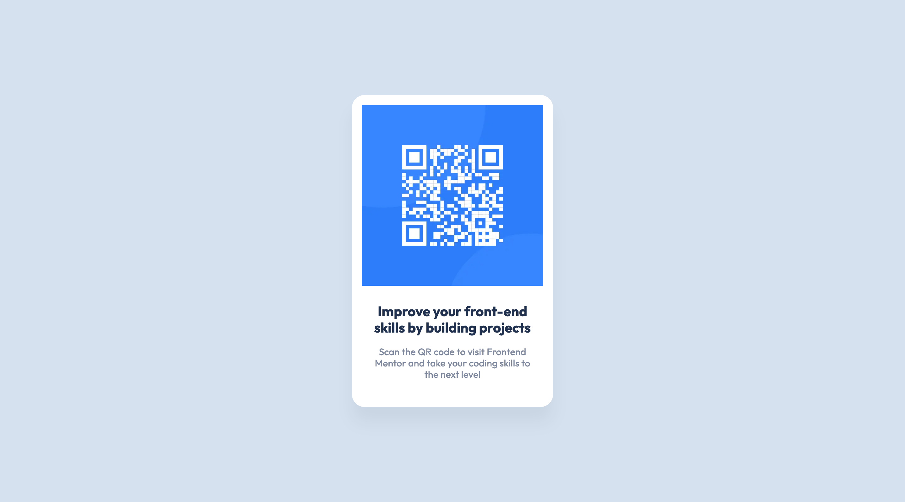
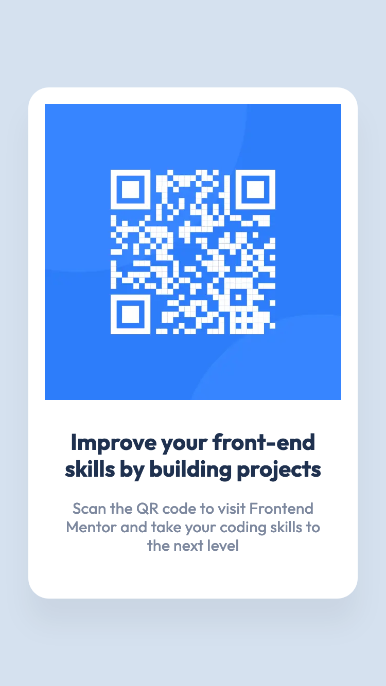

# Frontend Mentor - QR code component solution

This is a solution to the [QR code component challenge on Frontend Mentor](https://www.frontendmentor.io/challenges/qr-code-component-iux_sIO_H). Frontend Mentor challenges help you improve your coding skills by building realistic projects.

## Table of contents

- [Overview](#overview)
  - [The challenge](#the-challenge)
  - [Screenshot](#screenshot)
  - [Links](#links)
- [Getting Started](#getting-started)
  - [Prerequisites](#prerequisites)
  - [Installation](#installation)
- [My process](#my-process)
  - [Built with](#built-with)
  - [What I learned](#what-i-learned)
  - [Continued development](#continued-development)
  - [Useful resources](#useful-resources)
- [Author](#author)

## Overview

### The challenge

Users should be able to:

- Scan the QR code to visit Frontend Mentor and take their coding skills to the next level

### Screenshot

<div style='display: flex; gap: 10px;'>


</div>

### Links

- Solution URL: [https://www.frontendmentor.io/solutions/qr-code-component-with-nextjs-tailwind-css-css-module-bem-7Fz9-EgtRX](https://www.frontendmentor.io/solutions/qr-code-component-with-nextjs-tailwind-css-css-module-bem-7Fz9-EgtRX)
- Live Site URL: [qr-code-component-ten-pink.vercel.app](qr-code-component-ten-pink.vercel.app)

## Getting Started

To get a local copy up and running follow these simple steps:

### Prerequisites

Make sure you have the following software installed on your machine:

- [Node.js](https://nodejs.org/) (Node.js 18.17 or later)
- [pnpm](https://pnpm.io/)

### Installation

1. Clone the repository:

   ```sh
   git clone https://github.com/jaceleedev/qr-code-component.git
   ```

2. Navigate to the project directory:

   ```sh
   cd qr-code-component
   ```

3. Install dependencies using pnpm:

   ```sh
   pnpm install
   ```

4. Start the development server:

   ```sh
   pnpm dev
   ```

5. Open your browser and visit http://localhost:3000 to view the project.

## My process

### Built with

- Next.js (v14.2.5)
- TypeScript (v5)
- Tailwind CSS (v3.4.1)
- CSS Modules
- CSS BEM methodology
- Semantic HTML5 markup
- SEO & web accessibility

### What I learned

During this project, I reinforced my skills in Next.js and Tailwind CSS. I learned the importance of project structure, specifically how creating folders named after components and using index.tsx files can simplify imports. This was a new insight compared to my previous project. This structure enhances the maintainability and readability of the code, making it easier to manage and scale.

#### Code snippets:

```bash
components
└── QRCode
    ├── index.tsx
    └── index.module.css
```

### Continued development

In future projects, I aim to deepen my expertise in Next.js and Tailwind CSS, with a particular focus on optimizing project structure and embracing component-based architecture. My goal is to build more accessible and performant web applications, prioritizing seamless user experiences and scalable codebases.

### Useful resources

- [Next.js Documentation](https://nextjs.org/docs) - Comprehensive guide to Next.js features and API.
- [Tailwind CSS Documentation](https://tailwindcss.com/docs/installation) - Detailed documentation for Tailwind CSS.

## Author

- GitHub - [@jaceleedev](https://github.com/jaceleedev)
- Frontend Mentor - [@jaceleedev](https://www.frontendmentor.io/profile/jaceleedev)
