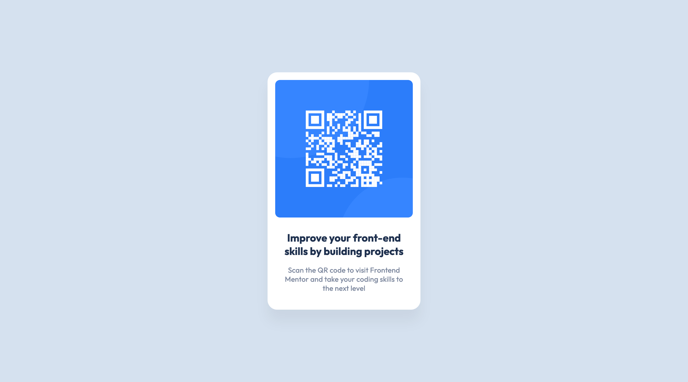

# Frontend Mentor - QR code component solution

This is a solution to the [QR code component challenge on Frontend Mentor](https://www.frontendmentor.io/challenges/qr-code-component-iux_sIO_H). Frontend Mentor challenges help you improve your coding skills by building realistic projects.

## Table of contents

- [Overview](#overview)
  - [Screenshot](#screenshot)
  - [Links](#links)
- [My process](#my-process)
  - [Built with](#built-with)
  - [What I learned](#what-i-learned)
  - [Useful resources](#useful-resources)
- [Author](#author)

## Overview

### Screenshot

### Links

- Solution URL: [solution URL](https://github.com/jaceleedev/frontend-mentor/tree/main/1.%20newbie/qr-code-component)
- Live URL: [live URL](https://jaceleedev.github.io/qr-code-component)

## My process

### Built with

- HTML5
- CSS3
- Figma Design

### What I learned

css flexbox를 사용하면서, 다시 한번 복습하는 계기가 되었다.

### Useful resources

- [css flexbox guide](https://css-tricks.com/snippets/css/a-guide-to-flexbox/) - css flexbox를 쉽게 이해하는데 도움이 되었다.

## Author

- Github - [Jaceleedev](https://github.com/jaceleedev)
- Frontend Mentor - [Jaceleedev](https://www.frontendmentor.io/profile/jaceleedev)
